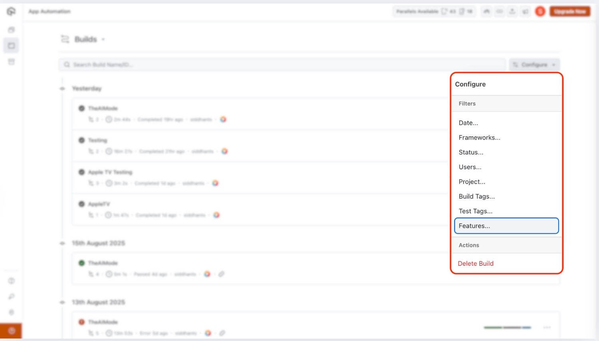
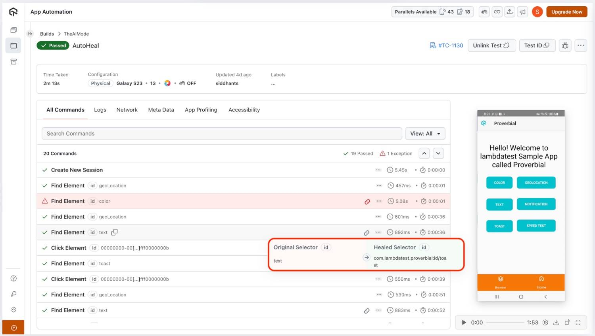

import CodeBlock from '@theme/CodeBlock';
import {YOUR_LAMBDATEST_USERNAME, YOUR_LAMBDATEST_ACCESS_KEY} from "@site/src/component/keys";

import Tabs from '@theme/Tabs';
import TabItem from '@theme/TabItem';

# AI-Powered Smart Heal for Automation Tests

Locator failures can make tests brittle and cause frequent failures, slowing down development and testing. LambdaTest’s **Smart Heal** uses **AI/ML-powered algorithms** to automatically detect and recover from locator issues during test execution, ensuring smoother and more reliable automation.

LambdaTest now lets you enable **Smart Heal** for automation testing. This feature helps developers and testers handle locator failures without manual effort by intelligently detecting missing elements, analyzing the UI in real time, and applying the closest valid match. It keeps tests running smoothly despite UI changes and provides full visibility into healing actions, including both the **original and recovered locators** through logs and the LambdaTest dashboard.

> Smart Heal feature is currently in **closed beta** and continuously improving based on user feedback. Once publicly released, it will be available as part of AI credits—please reach out via <span className="doc__lt" onClick={() => window.openLTChatWidget()}>**24×7 chat**</span> or email us at **support@lambdatest.com** to enable it for your organization and try it out.

---
## Use Cases

- **Frequent UI Updates**: When product teams ship fast and locator changes are common, Smart Heal prevents brittle tests from breaking on every release and make shipments fast.
- **CI/CD Reliability**: Reduce flaky build failures by automatically recovering from locator issues in pipelines.
- **Maintenance Reduction**: Spend less time fixing scripts manually and more time building new coverage.Deploy first and fix later.
- **Audit & Debugging**: Use healed locator logs and screenshots to understand changes quickly and improve your scripts over time.

---
## Smart Heal Workflow

1. **Baseline Creation**  
- For Smart Heal to work, you must first have at least one successful baseline (**Passed Test**) run—so make sure to include the LambdaTest hook in your tests to explicitly mark them as passed (lambda-status=passed). With a baseline in place, the Auto-Heal engine can detect changes and attempt locator recovery. Since Smart Heal uses AI-driven analysis, expect executions to take slightly longer than usual.
5:47


- On the initial successful test run with Smart Heal enabled, LambdaTest captures a **baseline snapshot** of all element locators in your script. This baseline serves as the foundational reference for future healing attempts, ensuring that any changes to the UI can be intelligently detected and addressed.  

2. **Baseline Updation**  
   After each successful test run, Smart Heal can automatically update your baseline to reflect the latest fully passed build. This ensures that the most recent valid UI state is used as the reference for future healing attempts. Keeping the baseline updated helps maintain accurate detection of element changes and reduces unnecessary healing actions.

2. **Detection and Healing**  
   In subsequent runs, if an element cannot be found due to **UI or DOM changes**, Smart Heal triggers automatically, leveraging **AI-driven analysis** of element attributes, hierarchy, and **visual cues** to find the closest valid match in the updated UI.

3. **Retry with Healed Locator**  
   When a likely match is found, the test step retries with the **healed locator**. These adjustments apply at runtime so the test flow continues without interruption. Both the original and healed locators are logged for full transparency.

4. **Fallback and Suggestions**  
   If Smart Heal cannot confidently identify an alternative, it records **AI-driven suggestions** in the dashboard. These insights help you quickly update or strengthen your locators to avoid repeated failures in future runs.

:::tip
For every user the **project name** and **test name** must remain the same across runs for Smart Heal to be applied successfully.
:::
---

## Smart Heal in Automation Tests

### 1. Upload Your App

Before enabling Smart Heal, ensure your app is uploaded to LambdaTest.

1. Follow the [Upload Your Application](https://www.lambdatest.com/support/docs/upload-your-application/) guide.
2. Once uploaded, **note the App ID** returned by the API or dashboard.
3. Use this **App ID** in the `"app"` capability in your automation script.

---

### 2. Enable Smart Heal with Capabilities

To enable Smart Heal, add `"smartHeal": true` to your desired capabilities in your Appium test script.

<Tabs className="docs__val">
<TabItem value="ios" label="iOS" default>

```python
desired_caps = {
    "deviceName": "iPhone 16",
    "platformName": "iOS",
    "platformVersion": "18",
    "isRealMobile": True,
    "app": "YOUR_APP_URL",
    "build": "Smart Heal iOS",
    "name": "Sample Smart Heal Test",
    # highlight-next-line
    "smartHeal": True
}
```

</TabItem>

<TabItem value="android" label="Android" default>

```python
desired_caps = {
    "deviceName": "Galaxy S25",
    "platformName": "Android",
    "platformVersion": "16",
    "isRealMobile": True,
    "app": "YOUR_APP_URL",
    "build": "Smart Heal Android",
    "name": "Sample Smart Heal Test",
    # highlight-next-line
    "smartHeal": True
}
```

</TabItem>
</Tabs>

:::tip
You can generate capabilities for your test requirements with the help of our inbuilt [**Capabilities Generator tool**](https://www.lambdatest.com/capabilities-generator/). For more details, please refer to our guide on [**Desired Capabilities in Appium**](https://www.lambdatest.com/support/docs/desired-capabilities-in-appium/).
:::

### 3. Enable Smart Heal with Runtime Hooks

You can also control Smart Heal dynamically during test execution using runtime hooks. This is useful when you want healing active in specific phases or after major UI changes.

```java
// Start Smart Heal
driver.executeScript("lambda-heal-start");

// Stop Smart Heal
driver.executeScript("lambda-heal-stop");

```

### 4. Running Your Tests

Once your app is uploaded and Smart Heal is enabled (either via capabilities or runtime hooks), execute your test script as usual with your preferred automation framework. Smart Heal will monitor for locator failures during the run, apply healing when possible, and log all details to the LambdaTest dashboard for review.

---

# Viewing Results in Dashboard

### Accessing the Dashboard
Your test results are displayed on the [LambdaTest App Automation Dashboard](https://appautomation.lambdatest.com/build).

### Filtering Healed Builds
To display only healed builds, click on the **Configure** option at the top of the dashboard.  

- The following image shows the **Configure box**, with the **Features** tab highlighted:  


- When you open the **Features** tab, a pop-up appears where you can enable **Auto-Heal** to filter and display only executions where Smart Heal was applied:  


- Once filtering is applied, the dashboard highlights all healed elements in your tests. In this view, healed elements are marked clearly, while those that could not be healed are highlighted in red:  


### Hovering Over Healed Builds
Each healed build has an associated icon. Hovering over this icon provides a tooltip that shows a brief summary of the session and the healing actions performed.  



### Session Details
Access detailed execution logs that clearly differentiate between **original and healed selectors**, along with AI suggestions, and compare before-and-after screenshots. These insights help you understand how the Auto-Heal mechanism worked during execution and guide you in refining locators over time.


### AI Review on Failures
When a test case fails, the dashboard provides **AI-powered analysis and suggestions** to help you quickly identify root causes and fix issues.


:::info
Smart Heal delivers the best results when applied to **static components** such as buttons or form fields, where locators remain relatively consistent across runs.  
:::
