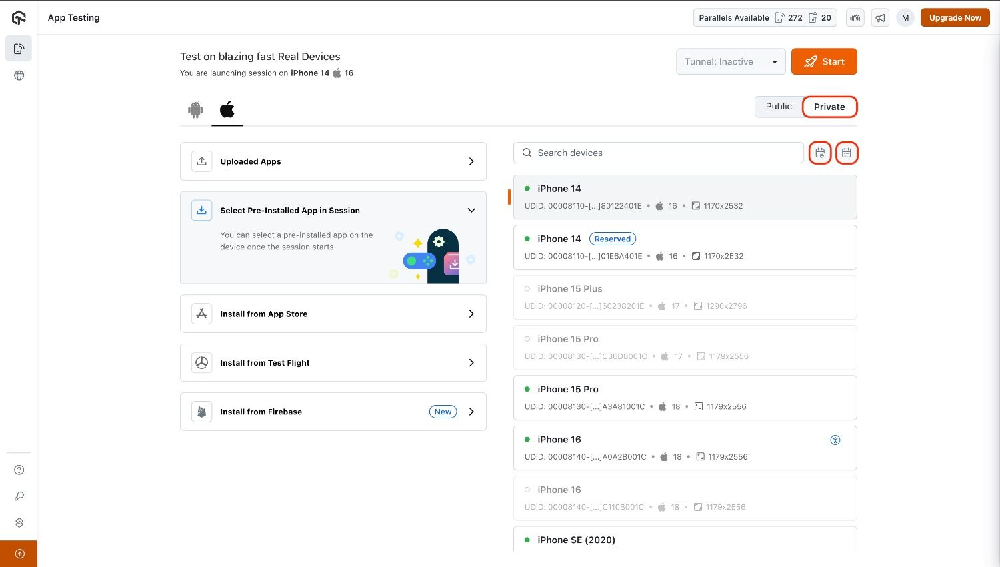
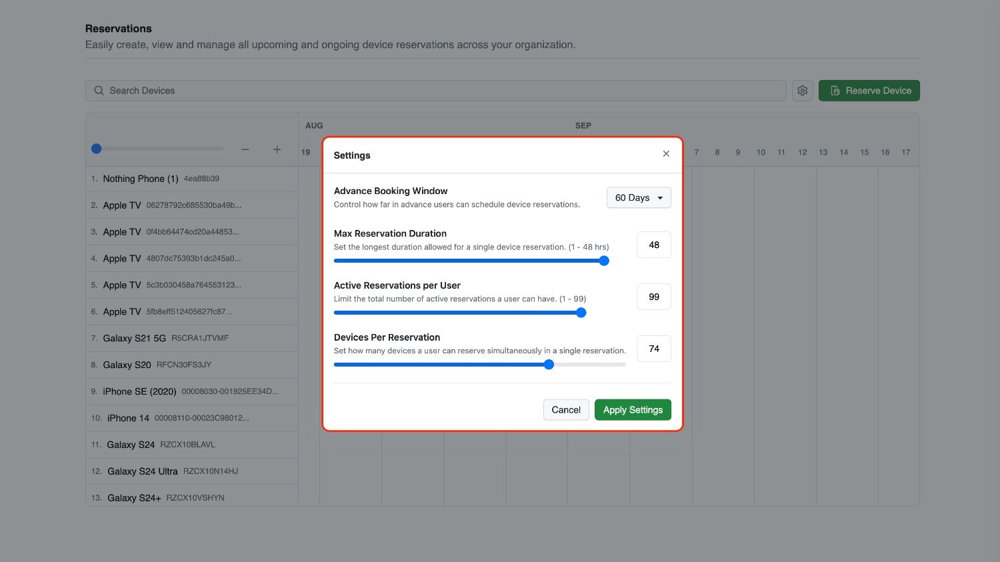
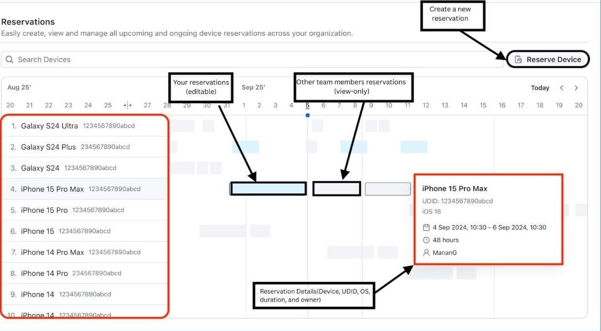
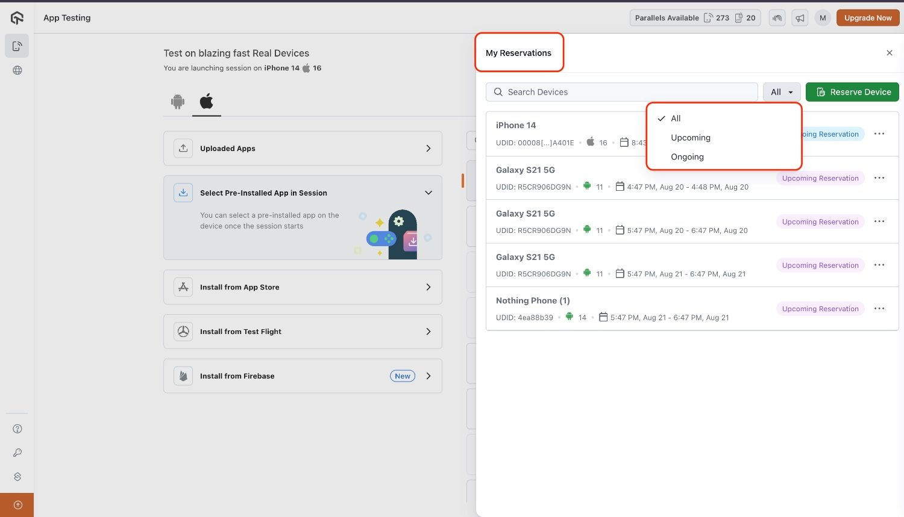

import CodeBlock from '@theme/CodeBlock';
import {YOUR_LAMBDATEST_USERNAME, YOUR_LAMBDATEST_ACCESS_KEY} from "@site/src/component/keys";

import Tabs from '@theme/Tabs';
import TabItem from '@theme/TabItem';

# Device Reservation on Private Device Cloud

**LambdaTest Device Reservation** enables users to reserve private cloud devices in **advance**, ensuring uninterrupted access during critical testing windows. By scheduling devices ahead of time, teams can **prevent conflicts**, eliminate last-minute delays, and run both manual and automated tests with greater reliability. This becomes particularly valuable for time-sensitive releases, large-scale regression cycles, and continuous integration pipelines, where guaranteed device availability is essential.

Beyond preventing scheduling conflicts, Device Reservation also helps organizations **optimize resource utilization**, enforce fair usage policies, and gain clearer visibility into device allocation across teams, leading to more efficient and predictable testing operations.

> Device Reservation feature is currently in **closed beta** and continuously improving based on user feedback. please reach out via  window.openLTChatWidget()}>**24×7 chat** or email us at **support@lambdatest.com** to enable it for your organization and try it out.
---

## Use Cases 

- **Release-Day Reliability**: Reserve devices in advance to guarantee uninterrupted testing during production releases or hotfix rollouts.  
- **Parallel Test Execution**: Secure multiple devices for running automated test suites in parallel, speeding up regression cycles.  
- **Cross-Team Coordination**: Schedule device bookings across QA, Dev, and Ops teams to align on shared testing timelines.  
- **Peak Hour Management**: Prevent conflicts during high-demand periods by ensuring fair access and availability through reservations.  
- **Optimized Resource Utilization**: Track and manage reservations to avoid idle devices and maximize the ROI of your private cloud setup.

---
## Device Reservation Workflow 

### Accessing the App Live Dashboard
1. Open the [App Live Dashboard](https://applive.lambdatest.com/app).
2. Enable the toggle for Private Devices (**Available only for private device customers**).
3. The User will see two buttons:
        - **My reservations** – View all ongoing and upcoming reservations with filter options.
        - **Go to Reservations** – Open the calendar view to explore and manage bookings.

First-time visitors will see an empty calendar and must create a reservation to begin scheduling devices.

:::

### Admin Privilege

Admins have additional controls to manage device reservations, accessible inside **Go to Reservations** under the settings button (as shown below):

- **Advance Booking Window** – Define how far in advance members can schedule reservations.
- **Max Reservation Duration** – Set the maximum duration allowed for a reservation (1–48 hours).
- **Active Reservations per Member** – Limit the number of active reservations per member (1–99).
- **Devices per Reservation** – Define how many devices can be booked in one reservation.

### Calendar View and Permissions

The **calendar** view differs for members and admins:

- **Members:**
  - The member view shows a calendar with reservation blocks for devices.
  - `Blue blocks` represent the member’s own reservations, which can be edited or deleted.
  - `Grey blocks` represent reservations made by other team members. Members cannot edit or delete these.

     

- **Admins:**
  - Admins can view and manage all reservations on the calendar.
  - They have full control to create, edit, or delete any reservation.

### Creating a Reservation

To create a reservation, click **Reserve Device** from the calendar view. Then choose the type of reservation:

- **Immediate Reservation** – Reserve a device instantly for 1 to 12 hours.
   
- **Future Reservation** – Schedule a reservation for a later date/time within the allowed scheduling window.
   

Select **one or multiple devices** based on availability and confirm the reservation.

### Viewing and Editing Reservations

After adding reservation slots, the user can view them under **My Reservations** and make edits or cancellations if required.

### Session Expiry and Extensions

These rules apply to both admins and members, except admins can still override reservations.

- In the last **15 minutes** of a reservation, a pop-up appears notifying the user that the session is about to end.
- If no pre-booked reservation exists for the device, the user will have the option to extend the session.
- If another booking is already scheduled for the device, the extension option will still appear, but the request will **fail**.
- Once the reserved time ends, the device session is automatically closed and released.

:::tip
- Reservation cannot be edited after the slot has been started.
- If an **admin** deletes any reservation, it is **cancelled** immediately.
- In automation, reservations cannot be extended automatically in the last 15 minutes. Extensions must be handled manually.
:::