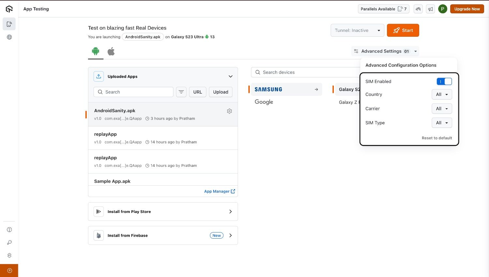
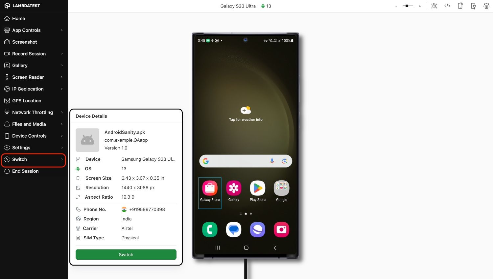

import CodeBlock from '@theme/CodeBlock';
import Tabs from '@theme/Tabs';
import TabItem from '@theme/TabItem';

# SIM Support On Public Real Devices

SIM & eSIM support allows testers to validate **SMS-driven workflows** on real mobile devices, including **OTP verification** and **two-factor authentication**. By using SIM-enabled devices manually, you can test SMS handling, **verify phone numbers**, and confirm secure onboarding processes without needing physical test phones in hand.  

**SMS-based authentication** is a widely used security and identity verification method. Testing these flows manually on real devices ensures accurate results, provides hands-on visibility, and helps confirm a smooth experience for end-users.  

With **LambdaTest**, you can manually test SIM and eSIM scenarios on **Real Devices**. From selecting SIM-enabled devices in the dashboard to receiving OTPs directly on-screen, LambdaTest offers a complete setup for validating SMS-driven features during live testing sessions.  

> To enable this for your organization, contact us via  window.openLTChatWidget()}>**24×7 chat support** or email **support@lambdatest.com**. 

---

## Use Cases

- **OTP & Two-Factor Testing**: Manually trigger SMS-based login or sign-up and verify OTP delivery and entry.  
- **Phone Number Validation**: View the device’s number during a session and confirm its use in verification flows.  
- **SMS Interrupt Testing**: Receive SMS messages during testing and check how the app responds to message interrupts.  
- **Messaging Workflows**: Validate outbound and inbound SMS behavior while interacting with the app manually.  

---

## Configuring SIM Support for Manual Testing

### Step 1: Enable SIM Support
On the App Testing Dashboard, click **Advanced Settings** and enable the **SIM Enabled** toggle. This will unlock additional options for configuring SIM and eSIM.  

  

### Step 2: Select SIM Configurations
Choose your **Country**, **Carrier**, and **SIM Type**. The availability of SIM types may vary by region and device.

| Country | Carriers               | SIM Type Availability        |
|---------|-----------------------|-----------------------------|
| Ireland | Three                 | Physical SIM / eSIM (iOS only) |
| India   | Airtel, Jio, Vodafone | Physical SIM                |
| USA     | T-Mobile, Verizon, AT&T | Physical SIM / eSIM (iOS only) |

:::info
- For customers with the **region filter** enabled, the country option will not be available for selection. In such cases, the country is automatically determined by the chosen region.  
- Currently, **eSIM support is limited to selected iPhone models only**. Android devices support **physical SIM** at this time.  
:::

### Step 3: Start a Manual Session
Launch a real device session from the dashboard.  

### Step 4: Verify Device Details
From the session toolbar, open **Switch** to view details such as **Phone Number**, **Region**, **Carrier**, and **SIM Type**. Verify that the device matches your intended test configuration.  

  

### Step 5: Begin Testing
With the device configured and details verified, you can now proceed to test your application under real SIM conditions. Use the session to validate how your app interacts with SMS messages, confirm that authentication flows work as expected, and observe the overall user experience in a live environment.   

## Supported Devices

| Device                  | OS Version  |
|--------------------------|-------------|
| Samsung Galaxy S25 Ultra | Android 15  |
| Samsung Galaxy S25       | Android 15  |
| Samsung Galaxy S24       | Android 14  |
| Samsung Galaxy S23       | Android 13  |
| Google Pixel 9           | Android 15  |
| Google Pixel 7           | Android 13  |
| Google Pixel 6           | Android 12  |
| iPhone 16 Pro            | iOS 18      |
| iPhone 15 Pro            | iOS 17      |
| iPhone 14                | iOS 16      |
| iPhone 14 Pro            | iOS 16      |
| iPhone 13                | iOS 15      |
| iPhone 13 Mini           | iOS 15      |

---